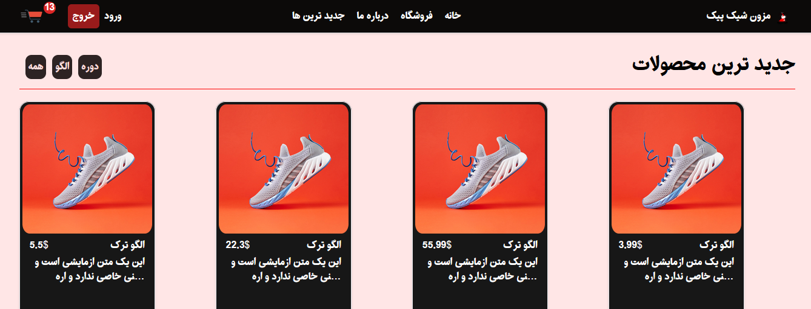

## React Ts e-commerce website!

this project is an e-commerce platform built using react ts(TypeScript)which gives a perfect shopping expreince to users.this is designed by **Tailwind css** mostly,but some parts are not fully responsive yet but they will be in future.
## featurs
-**Products Api** : in this project we have dynamic data in our db.json which plays a role as our database, but in reality we use other databases such as mongo db and ... 
but as a fron-end developer i used json-server to have this dynamic data.
we run this file live by following command :
```Terminal
npx json-server data/db.json -p 8001
```
but before that you need to install json!
for more info [check out here!](https://www.npmjs.com/package/json-server)
- **API** : to get datas from db.json i created getProduct function using this codes :
```TypeScript
export async function getProduct(id: string | number ){
    const { data } = await client(`/products/${id}`)

    return data
}
```
**client** is a varible i created above that which contains our baseURL.
you can checkout my full codes on this api in SERVICES folder in SRC
- **category**: well categorising in reality always depends on the api created by backend developer in the project, i tried to figure out a way to have this feature in my project which was one of the most challemging parts of this project which you can chekout how its done in Store.tsx in Pages folder in SRC.
key point:
```React TSX
 const [products, setProducts] = useState<IProduct[]>([]);
  const [filteredProducts , setFilteredProducts] = useState<IProduct[]>([])
  const [category , setCategory ] = useState<string>('all')

  useEffect( () => {
    const fetchData = async () => {
      const data = await getProducts();
      setProducts(data)
    }
    fetchData()
  },[])

  useEffect(()=>{
    if(category === 'all'){
      setFilteredProducts(products)
    }else{
      setFilteredProducts(products.filter(
        product => product.category === category
      ))
    }
  },[ category, products])

  const handleCategoryChange=(newCategory:string) => {
    setCategory(newCategory)
  }
  
  console.log(products)
```
and then in our TSX we return data using **Map** Method.
- **User Authentication** : i used PriveteRoute for the login page c when ever you logOut, you wont be able to use Cart section.if you are already logined you will be navigated to home page.and by submitting the login , youre data is send to the local storage and if backend feature become in this project you can get token by pressing login buttob
- **state managment** : as many other projects are geting developed by react these days using Context, i decided to use the same state management instead of Redux.
in this project most logic we use is about Cart, so i only have ShoppingCartContext but you can have as many contexts as you need.
```ReactTs
export const useShopingCartContext = ()=>{
    return useContext(ShopingCartContext)
}
```
- there are other features in this project that are not mentioned here.


## Tech Stack
- **frontend**: React,TypeScript (TSX)
- **state management**: Context API
- **Routing**: React-Router-Dom
- **Styles**: css , tailwind.css
- **Build tools**: Vite
- **Version Control system**: git and github

## Getting Started : 
### Prerequisties
- **Node js**
- **Npm**
### installation 
1. **Clone the Repository:**
 ```Bash
    git clone https://github.com/omidSahzabi/e-commerece-1
 ```
2. **navigate to the project directiry**:
   ```Bash
   cd e-commerce-1
3. **install dependencies**
   ```Bash
   npm install
   ```
### Running the project :
1. run db.json:
   ```Bash
   npx json-server data/db.json -p 8001
   ```
2. run the app
   ```Bash
   npm run dev
   ```
**and thats it** now you will have the project running in the localHost !

## Contact :
my email: _omidpanahiyan5700@gmail.com_

Thank you for reading! happy hackink...

2024 - &copy; OmidSahzabi


